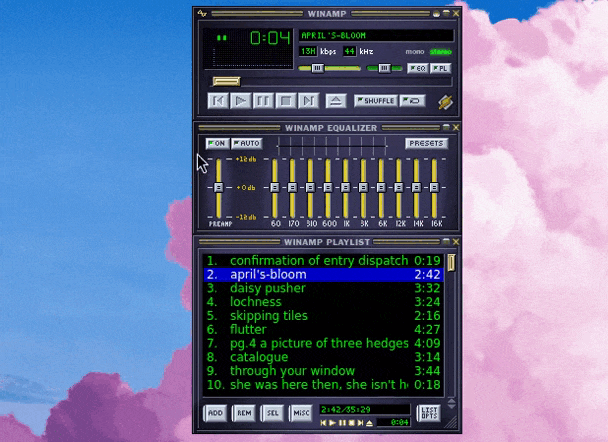

It's missing a lot of basic features like adding songs to the queue.

# MPD client that uses classic Winamp skins



Made from the code from the [skins-qt plugin from audacious](https://github.com/audacious-media-player/audacious-plugins).

To run:
```
cmake .
make
./build/mpd-client <extracted theme path>
```
